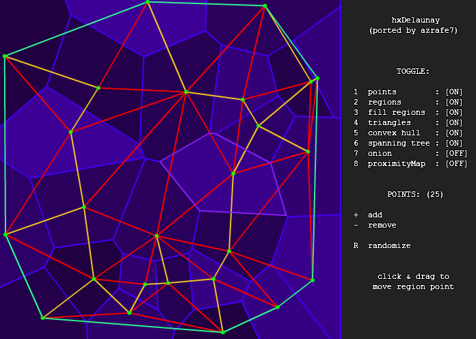

hxDelaunay
==========

Port to Haxe 3 of [sledorze/hxDelaunay](https://github.com/sledorze/hxDelaunay) (itself a port of the excellent [nodename/as3delaunay](https://github.com/nodename/as3delaunay)).

Changes:

 - Added OpenFL demo
 - Fixed for cpp & neko targets
 - Added crosstarget hitTest support (for `keepOutMask`)
 - Ported to Haxe 3.1 (flash) 

Features:

 - [Voronoi diagram](http://en.wikipedia.org/wiki/Voronoi)
 - [Delaunay triangulation](http://en.wikipedia.org/wiki/Delaunay_triangulation)
 - [Convex hull](http://en.wikipedia.org/wiki/Convex_hull)
 - [Minimum spanning tree](http://en.wikipedia.org/wiki/Euclidean_minimum_spanning_tree)
 - [Onion](http://cgm.cs.mcgill.ca/~orm/ontri.html)

See original authors links for details and licensing stuff.
