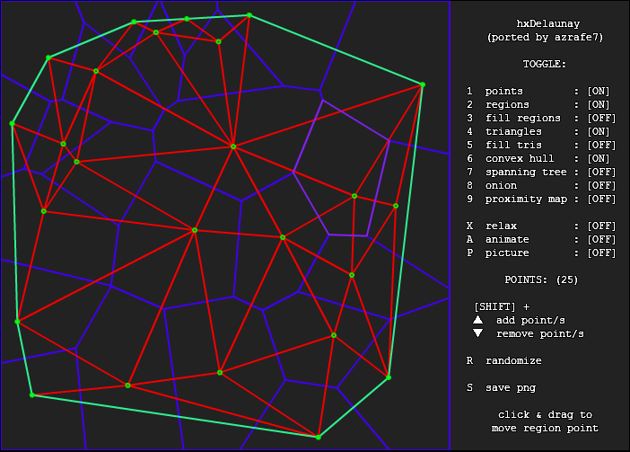
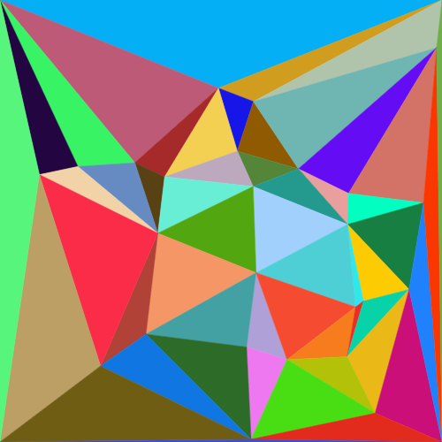
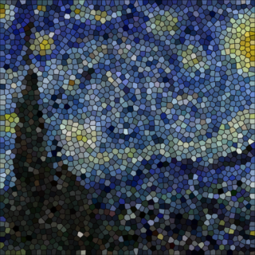
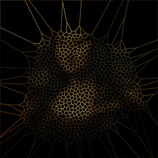
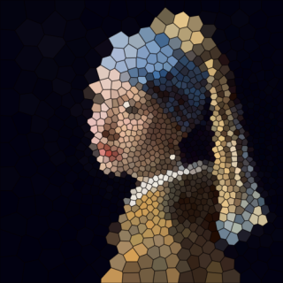

hxDelaunay
==========

Port to Haxe 3 of [sledorze/hxDelaunay](https://github.com/sledorze/hxDelaunay) (itself a port of the excellent [nodename/as3delaunay](https://github.com/nodename/as3delaunay)).

[](https://rawgit.com/azrafe7/hxdelaunay/master/bin/html5/bin/index.html)

_click the image above to try the [demo](https://rawgit.com/azrafe7/hxdelaunay/master/bin/html5/bin/index.html) in the browser_

No external dependencies (demo still needs openfl). Tested on flash/js/cpp/neko.

### Features: ###

 - [Voronoi diagram](http://en.wikipedia.org/wiki/Voronoi)
 - [Delaunay triangulation](http://en.wikipedia.org/wiki/Delaunay_triangulation)
 - [Convex hull](http://en.wikipedia.org/wiki/Convex_hull)
 - [Minimum spanning tree](http://en.wikipedia.org/wiki/Euclidean_minimum_spanning_tree)
 - [Onion](http://cgm.cs.mcgill.ca/~orm/ontri.html)

See original authors' links for details and licensing (MIT).


### Update:

- Delaunay triangulation visualization ([see JS code example](src/DemoJs.hx)).

[](https://rawgit.com/azrafe7/hxDelaunay/master/bin/js/index.html)

_click on image to see the code in action_

# screenshots





# haxelib local use

Currently there is no haxelib, but you can use this git repo as a development directory:

```
haxelib dev hxdelaunay path/to/folder
```

or use git directly:

```
haxelib git hxdelaunay https://github.com/azrafe7/hxDelaunay.git
```

don't forget to add it to your build file:

```
-lib hxdelaunay
```

or for **openfl**:

```
<haxelib name="hxdelaunay" />
```


Check out the [openfl example](src/Demo.hx) for more information.


Or a simpler [js code example](src/DemoJs.hx). See it in action here: [JavaScript example](https://rawgit.com/azrafe7/hxDelaunay/master/bin/js/index.html).

**Enjoy!**

